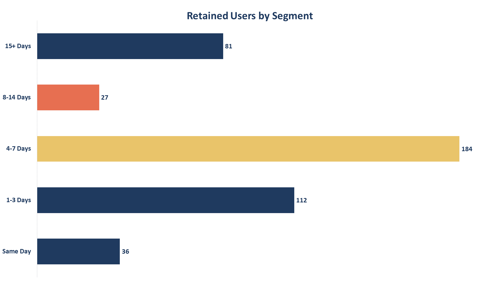

# **Early Adoption & Retention**
## **One Question Projects — Project 01**

## **Project Overview**
This project examines whether the timing of a user's first interaction with a product feature is associated with their 30-day retention. The analysis focuses on segmenting users based on how early they adopted the feature and comparing retention across these segments.

## **Business Problem**
Product teams need to understand which early user behaviors are associated with long-term engagement. If early adoption of a key feature is linked to higher retention, encouraging users to discover and use that feature earlier could become an opportunity to improve user retention.

## **Project Goal**
Determine whether users who adopt the feature earlier have higher 30-day retention rates than users who adopt it later.

## **Dataset Description**
The project uses three datasets representing user information, feature adoption behavior, and 30-day retention.

**users.csv**  
Contains basic user-level information.

| Column | Description |
| ------ | ----------- |
| `user_id` | Unique identifier for each user |
| `signup_date` | Date the user signed up |
| `country` | User's country |
| `platform` | Platform used by the user |

**feature_usage.csv** 
Contains each user's first usage of the analyzed product feature.

| Column | Description |
| ------ | ----------- |
| `user_id` | Unique identifier for each user |
| `feature_name` | Name of the feature |
| `first_used_date` | Date the user first used the feature |
| `days_after_signup` | Number of days between signup and first feature usage |

The `days_after_signup` field is used to classify users into feature adoption timing segments.

**retention.csv** 
Contains the 30-day retention status for each user.

| Column | Description |
| ------ | ----------- |
| `user_id` | Unique identifier for each user |
| `retained_30d` | Indicates whether the user was retained after 30 days (1 = Retained, 0 = Not Retained) |

## **Dataset Scope**
The three datasets are linked through user_id. The analysis combines feature adoption timing with 30-day retention to evaluate whether earlier feature adoption is associated with stronger long-term retention.

## **Business Question**
### **Does Early Feature Adoption predict long-term retention?**
### **Baseline KPIs**
The dataset includes **1,000 users**, with **640 users** adopting the feature, resulting in an **overall 64% adoption rate**. **The overall 30-day retention rate is 56.2%**, providing a baseline for evaluating retention across different adoption-timing segments.
### **Analysis**
#### **Segement Retention Rate**

#### **Adopting Users by Segement**

#### **Retianed Users by Segement**

Retention was compared across feature adoption timing segments by calculating the 30-day retention rate for each group. Users who adopted the feature within the **first 7 days** achieved a **74.94% retention rate**, compared with **54.82%** among users who adopted it **after 7 days**, a difference of **20.12** percentage points.

The results indicate **a strong positive association between early feature adoption and 30-day retention**, suggesting that users who adopt the feature earlier are more likely to remain active over the long term.

## **Recommendations**
* **Encourage new users to discover and adopt the feature within their first 7 days through onboarding prompts, contextual guidance, or targeted in-app messaging.**
* **Monitor early feature adoption as a potential leading indicator of user retention and prioritize interventions for users who have not adopted the feature during their first week.**

## Tools Used
- **Excel** — Data preparation & analysis
- **PowerPoint** — Data visualization

